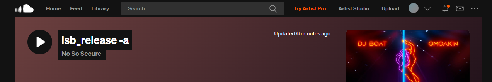
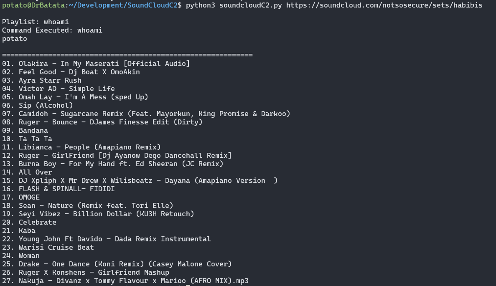

# SoundCloudC2
SoundCloudC2 is a simple extension of the idea taken from [SpotifyC2](https://github.com/NirvanaOn/SpotifyC2/) where `NirvanaOn` proved the possibility of executing commands on the local machine by hosting/adding commands as Playlist names. 

`SoundCloudC2` is the same implementation but in `Python3` to provide the same is possible via `SoundCloud` playlists as well. 

## How It Works
The script at its simplest, fetches the playlist from the URL Provided. For example:

`https://soundcloud.com/notsosecure/sets/habibis`

Where hte name of the main playlist is a command which is only executed as part of this implementation. However, the subsequent songs names (changes to commands) can also be executed.

The 2 implemented examples are provided as below.

## WHOAMI

## LSB_RELEASE -A

## Disclaimer

The code is provided for educational & research purpose only. Misuse and all the liabilities lies with the users who misuse the code. 